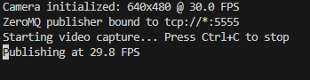
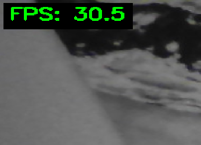
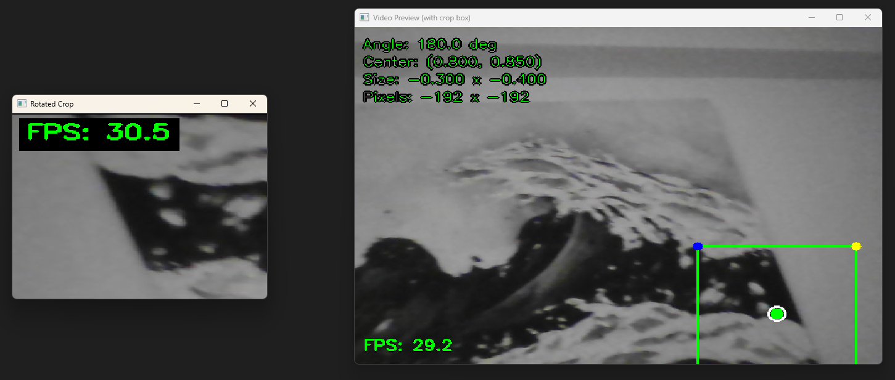

# Project Results Overview

A detailed walkthrough of the Robotics Vision Pipeline: how it works end-to-end, why the architecture was chosen, how edge cases are handled, and what the benchmarks tell us.

---

## Table of Contents

1. [Application Workflow](#application-workflow)
2. [Architecture Decisions](#architecture-decisions)
3. [Rotated Crop Algorithm](#rotated-crop-algorithm)
4. [Edge-Case Clamping Algorithm](#edge-case-clamping-algorithm)
5. [Benchmark Results](#benchmark-results)
6. [Application Screenshots](#application-screenshots)

---

## Application Workflow

The system runs as two independent processes communicating over the network:

```
  video_acquisition.py                              video_crop.py
 ┌────────────────────────────┐                   ┌───────────────────────────────────────┐
 │                            │     ZeroMQ        │                                       │
 │  Webcam ──► Serialize ──►  │ ── tcp://5555 ──► │  ──► Deserialize ──► Crop ──► Display │
 │             (20B header    │     PUB/SUB       │      (frombuffer     (warp    (imshow)│
 │              + raw pixels) │                   │       + reshape)     Persp.)          │
 └────────────────────────────┘                   └───────────────────────────────────────┘
```

### Step-by-step flow

1. **Capture** - `video_acquisition.py` opens the webcam via OpenCV's `VideoCapture` and reads frames in a loop.
2. **Serialize** - Each frame is packed into a binary message: an 8-byte `double` timestamp, followed by three 4-byte `int` values (height, width, channels), followed by the raw pixel bytes. Total header overhead: 20 bytes.
3. **Transmit** - The message is published on a ZeroMQ `PUB` socket bound to `tcp://*:5555`.
4. **Receive** - `video_crop.py` connects a ZeroMQ `SUB` socket to the publisher and receives frames.
5. **Deserialize** - The header is unpacked with `struct.unpack`, and the pixel data is reshaped into a NumPy array via `np.frombuffer` (near zero-copy).
6. **Crop** - The `RotatedCropper` class applies a cached perspective transform to extract a rotated rectangular region. Config is loaded from a JSON file.
7. **Display** - The cropped result is shown with `cv2.imshow`. Press `r` to hot-reload the config, `q` to quit.

### Key source files

| File | Role |
|------|------|
| `video_acquisition.py` | Webcam capture, frame serialization, ZeroMQ publisher |
| `video_crop.py` | ZeroMQ subscriber, deserialization, crop application, display |
| `utils/rotated_crop.py` | Core algorithm: `rotated_crop()`, `RotatedCropper`, `clamp_config()`, `validate_config()` |
| `configs/rcrop_parameters.json` | Default crop parameters (normalized coordinates) |
| `configs/cropconfig.htm` | Interactive browser tool for creating/adjusting crop configs |

---

## Architecture Decisions

### 1. Network Protocol: ZeroMQ PUB/SUB

Provides automatic message framing, built-in reconnection, and frame dropping under load (always showing the latest frame). Alternatives like raw TCP require manual framing/reconnection, UDP needs manual fragmentation for frames >65 KB, and HTTP/MJPEG adds per-frame overhead and lossy compression.

### 2. Serialization: Custom Binary Format

A fixed 20-byte header (`struct.pack('diii', timestamp, h, w, c)`) followed by raw pixel bytes. Deserialization is near zero-copy via `np.frombuffer`. Alternatives like pickle have security risks, JSON+base64 inflates data by ~33%, JPEG is lossy, and protobuf adds schema complexity for no benefit over a fixed header.

### 3. Rotated Crop: Single Perspective Transform

`cv2.getPerspectiveTransform` + `cv2.warpPerspective` maps directly from the rotated source rectangle to an axis-aligned output in one SIMD-accelerated operation. Alternatives like `warpAffine` + slice waste computation on the full image, and manual NumPy remapping lacks hardware acceleration.

### 4. Transform Caching

`RotatedCropper` caches the 3x3 perspective matrix and recomputes only when resolution or crop parameters change. For continuous video with fixed settings, the matrix is computed once and reused. Benchmarks show ~25% throughput improvement over recomputing each frame.

---

## Rotated Crop Algorithm

The core function `compute_rotated_corners()` calculates the four vertices of a rotated rectangle:

```
1. Start with an axis-aligned rectangle centered at (cx, cy):
       (-w/2, -h/2)  ───  (w/2, -h/2)
            │                    │
       (-w/2, h/2)   ───  (w/2, h/2)

2. Apply 2D rotation matrix (angle α, negated for image coordinates):
       ┌ cos(-α)  -sin(-α)    0   ┐
       │ sin(-α)   cos(-α)    0   │
       └    0        0        1   ┘

3. Translate corners back to center (cx, cy).

4. Use these 4 source corners + 4 destination corners (axis-aligned output)
   to compute a perspective transform matrix via cv2.getPerspectiveTransform.

5. Apply cv2.warpPerspective to extract the crop.
```

The result is the content inside the rotated rectangle, straightened into an axis-aligned output image.

---

## Edge-Case Clamping Algorithm

When the crop rectangle partially or fully extends outside the image, the `clamp_config()` function brings it back within bounds through a multi-step process:

### Algorithm steps

```
Input: config (alpha, ox, oy, width, height), image dimensions

Step 1 ─ Normalize angle to [0, 360)
Step 2 ─ Take absolute value of negative width/height
Step 3 ─ Compute rotated corners from raw config
         If bbox is completely outside the image → return None (skip crop)
Step 4 ─ Clamp center (ox, oy) to [0, 1]
Step 5 ─ Convert normalized coords to pixel coords
Step 6 ─ Compute the 4 rotated corners
Step 7 ─ Find the axis-aligned bounding box (min_x, max_x, min_y, max_y)
Step 8 ─ If any corner is outside image bounds:
           a. Compute scale = min(img_width / bbox_width, img_height / bbox_height)
           b. If scale < 1: shrink width and height by scale factor
           c. Recompute corners after scaling
           d. Shift center to push any remaining overflow back inside
Step 9 ─ Convert back to normalized coordinates
```

The key insight is that **scaling comes before shifting**. If the rotated bounding box is simply too large to fit at any position, it must be scaled down first. Only after the size fits do we nudge the center position to eliminate any remaining overlap with the boundary.

If the bbox is **completely outside** the image (all corners beyond one edge), `clamp_config()` returns `None` instead of a config dict. Callers handle this gracefully: `RotatedCropper.crop()` returns `None` (and `video_crop.py` skips the frame), while `visualize_clamping.py` renders an "OUT OF BOUNDS" placeholder.

### Visual demonstration

The image below shows six scenarios and how the clamping algorithm handles each. For each case, the **original** crop rectangle is shown alongside the **clamped** result:


**Cases shown (left to right, top to bottom):**

| # | Case | What happens |
|---|------|-------------|
| 1 | **Normal** | Crop fits within the image. No clamping needed. |
| 2 | **Negative width/height** | Dimensions are flipped to their absolute values; crop proceeds normally. |
| 3 | **Corner out of bounds** | Center is shifted inward so all four rotated corners land inside the image. |
| 4 | **Oversized** | Crop is larger than the image. Scaled down to the largest size that fits, then centered. |
| 5 | **Fully outside image** | If the bbox still overlaps after computing corners, center is clamped and the crop is scaled/shifted to fit. If all corners are beyond the image boundary, `clamp_config()` returns `None` and the crop is skipped. |
| 6 | **Huge angle** | Angle is normalized to [0, 360). The rotated bounding box is then scaled/shifted as needed. |

In all cases, the clamping ensures the crop fits within the image bounds.

---

## Benchmark Results

```
Python 3.12.4 | Windows AMD64 | 8 cores | NumPy 2.4.2 | OpenCV 4.13.0

Crop (cached transform)
  SD  640x480     1695 FPS (target 60)
  HD  1280x720    1060 FPS (target 45)
  FHD 1920x1080    722 FPS (target 30)

Crop (no cache)
  SD  640x480     1660 FPS
  HD  1280x720     912 FPS
  FHD 1920x1080    698 FPS

Full pipeline (deserialize + crop)
  SD  640x480     1236 FPS (target 60)
  HD  1280x720     655 FPS (target 45)
  FHD 1920x1080    358 FPS (target 30)
```

All targets exceeded by over 10x, leaving headroom for lower-spec hardware and other robotics tasks on the same machine.

---

## Application Screenshots

### Publisher window (video_acquisition.py)



### Subscriber window (video_crop.py) showing the cropped output



### Subscriber window (video_crop.py) and Video Preview (tests/video_preview.py) windows side by side


